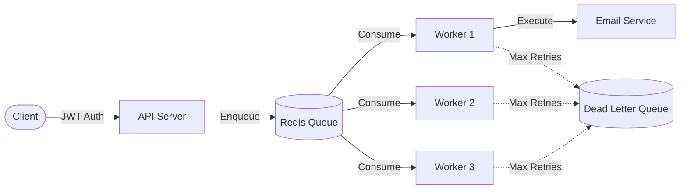

<div align="center">
  <h1>🚀 Distributed Job Scheduler</h1>
  <p><strong>A fault-tolerant distributed job scheduler built in Go using Redis</strong></p>
  
  [](https://golang.org)
  [](https://redis.io/)
  [](https://www.postgresql.org/)
  [](https://www.docker.com/)
  [](https://jwt.io/)
</div>

<br />

> **Overview**: This project demonstrates how modern backend systems handle background tasks reliably and at scale. Instead of executing tasks (like sending emails) synchronously, jobs are queued and processed asynchronously by multiple workers. This improves system responsiveness and enables horizontal scalability.

## 🌟 Key Features

- **✅ Asynchronous Job Processing**: Jobs are enqueued in Redis and consumed by independent workers using blocking queues.
- **🔐 JWT Authentication**: All endpoints (enqueueing jobs, viewing DLQ) are securely protected.
- **🔁 Exponential Backoff Retries**: Automatic, intelligent retries on failure (`1s → 2s → 4s → 8s`).
- **☠️ Dead Letter Queue (DLQ)**: Persists failed jobs (with error messages, retry counts, and failure timestamps) to a safe `failed_jobs` space.
- **⚡ Distributed Workers**: Support for horizontal scaling via Docker; run multiple worker instances to consume jobs in parallel.

---

## 🏗️ System Architecture



---

## 🔄 Job Lifecycle

1. **User signs up** (JWT authenticated)
2. **API enqueues** job to Redis
3. **Multiple workers** consume jobs from the queue
4. **Job execution outcomes**:
   - ✅ **Success** → Job is marked completed
   - ❌ **Failure** → Retried with exponential backoff
   - ☠️ **Max retries reached** → Moved to Dead Letter Queue (DLQ)

---

## 🚀 Getting Started

### Prerequisites

- Docker & Docker Compose
- Go 1.21+ (if running locally without Docker)

### Running the Project

Start the entire infrastructure (API, Database, Redis, and Worker) with one command:

```bash
docker-compose up --build
```

### ⚡ Scaling Workers

Easily demonstrate distributed processing by scaling up the number of workers:

```bash
docker-compose up --scale worker=3
```

**Example Output:**
```text
worker-1 | Worker: f82a11f88c4e processing job: job_abc123
worker-2 | Worker: 7dbf03042e66 processing job: job_def456
worker-3 | Worker: 607a7ab9242c processing job: job_ghi789

worker-1 | Successfully sent welcome email to user1@example.com
worker-2 | Successfully sent welcome email to user2@example.com
```
*👉 Each worker processes different jobs independently, proving horizontal scalability.*

---

## 🔌 API Endpoints

| Endpoint | Method | Description | Auth Required |
|----------|--------|-------------|---------------|
| `/jobs` | `POST` | Enqueue a new job | 🔐 Bearer Token |
| `/failed-jobs` | `GET` | Retrieve Dead Letter Queue jobs | 🔐 Bearer Token |
| `/retry-job` | `POST` | Retry a specific failed job | 🔐 Bearer Token |

---
