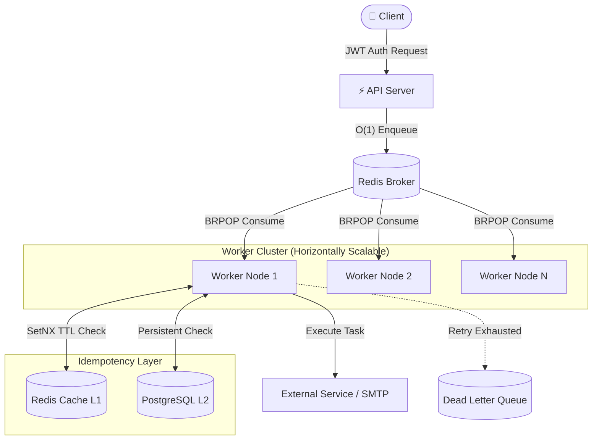

<div align="center">
  
  <h1>🚀 Distributed Fault-Tolerant Job Scheduler</h1>
  <p><strong>A highly scalable, distributed task scheduling system engineered in Go, backed by Redis and PostgreSQL</strong></p>

  <p>
    <a href="https://golang.org"></a>
    <a href="https://redis.io/"></a>
    <a href="https://www.postgresql.org/"></a>
    <a href="https://www.docker.com/"></a>
    <a href="https://jwt.io/"></a>
  </p>
</div>

<br />

> **Overview**: Designed to mirror production-grade backend systems, this project implements a resilient background job processing architecture. It decouples synchronous execution (like sending emails) into a highly available, asynchronous queue processed by horizontally scalable worker nodes, ensuring absolute reliability and idempotency even under systemic stress.

---

## 🌟 System Highlights & Engineering Constraints

Built with production-grade system design principles in mind, focusing on reliability, horizontal scalability, and data consistency.

- **⚡ Asynchronous Distributed Processing**: Utilizes Redis as an in-memory message broker. Independent worker nodes consume jobs via blocking pop operations (`BRPOP`), eliminating busy-waiting and minimizing latency.
- **🛡️ Bulletproof Idempotency (L1/L2 Caching Layer)**: Implements exactly-once execution semantics. Employs Redis (`SetNX` with TTL) as an ultra-fast L1 cache to short-circuit duplicates, backed by PostgreSQL as an L2 persistent store with `UNIQUE` constraints to guarantee data integrity.
- **🔁 Intelligent Fault Tolerance**: Features an exponential backoff retry mechanism (`1s → 2s → 4s → 8s`) for transient failures, preventing cascading system overloads.
- **☠️ Dead Letter Queue (DLQ)**: Jobs exceeding maximum retries are safely persisted to a persistent DLQ for manual intervention, observability, and debugging.
- **🔐 Secure API Boundaries**: Strict JWT-based authentication for all external system interactions.
- **🐳 Containerized & Orchestrated**: Fully Dockerized environment ensuring identical parity between development and production deployments.

---

## 🏗️ Architecture & Data Flow



### 📂 Codebase Architecture

```text
├── cmd/
│   ├── api/          # Main API server entrypoint & HTTP handlers
│   └── worker/       # Worker node entrypoint & background processing logic
├── internals/
│   ├── db/           # Database connection & pooling setup
│   ├── redis/        # Redis client & queue management
│   └── store/        # Data access layer (PostgreSQL repositories)
├── migrations/       # SQL schema migrations (up/down)
├── docker-compose.yml # Container orchestration
└── Dockerfile        # Multi-stage build for Go services
```

---

## 🧠 Deep Dive: Idempotency Design

In distributed systems, network partitions or process crashes can lead to duplicate message deliveries. This system guarantees **exactly-once** execution side-effects (e.g., a user is never sent two welcome emails).

### Two-Tier Deduplication Strategy:
1. **L1 Fast-Path (Redis)**: Uses `SET key value NX EX 86400` for $O(1)$ atomic duplicate detection. Prevents DB bottlenecking.
2. **L2 Slow-Path (PostgreSQL)**: Fallback check against a durable relational table to ensure correctness across Redis cache evictions or worker failures.

```text
[Worker Acquires Job]
      │
      ▼
[Redis SetNX (L1 Cache)] ──(Exists)──> 🛑 SKIP (Idempotent)
      │
   (Not Found)
      ▼
[Postgres Check (L2 Store)] ──(Exists)──> 🛑 SKIP (Idempotent)
      │
   (Not Found)
      ▼
🚀 Execute Business Logic (e.g., Send Email)
      │
      ▼
💾 Update Postgres & Redis State
```

---

## 🚀 Getting Started

### Prerequisites

- Docker Engine & Docker Compose
- *Optional:* Go 1.21+ (if running bare-metal)

### 1. Spin Up the Infrastructure

Launch the API, Database, Redis broker, and a Worker node instantly:

```bash
docker-compose up --build
```

### 2. Demonstrate Horizontal Scalability

Simulate a high-throughput environment by dynamically scaling the worker pool:

```bash
docker-compose up --scale worker=5
```

<details>
<summary><b>👀 View Scaled Output Logs</b></summary>

```text
worker-1 | Worker: f82a11f88c4e processing job: job_abc123
worker-2 | Worker: 7dbf03042e66 processing job: job_def456
worker-5 | Worker: 607a7ab9242c processing job: job_ghi789

worker-1 | Successfully sent welcome email to user1@example.com
worker-2 | Successfully sent welcome email to user2@example.com
```
*Notice how traffic is distributed perfectly across the node cluster.*
</details>

---

## 🔌 API Contract

| Endpoint      | Method | Functionality | Auth Needed |
| ------------- | ------ | ----------- | ---- |
| `/addJob`     | `POST`   | Atomically enqueues a new background task | 🔐 Bearer JWT |
| `/failedJobs` | `GET`    | Fetches paginated jobs from the Dead Letter Queue | 🔐 Bearer JWT |

---

<div align="center">
  <p>Engineered with ❤️ and rigorous distributed system principles.</p>
</div>
